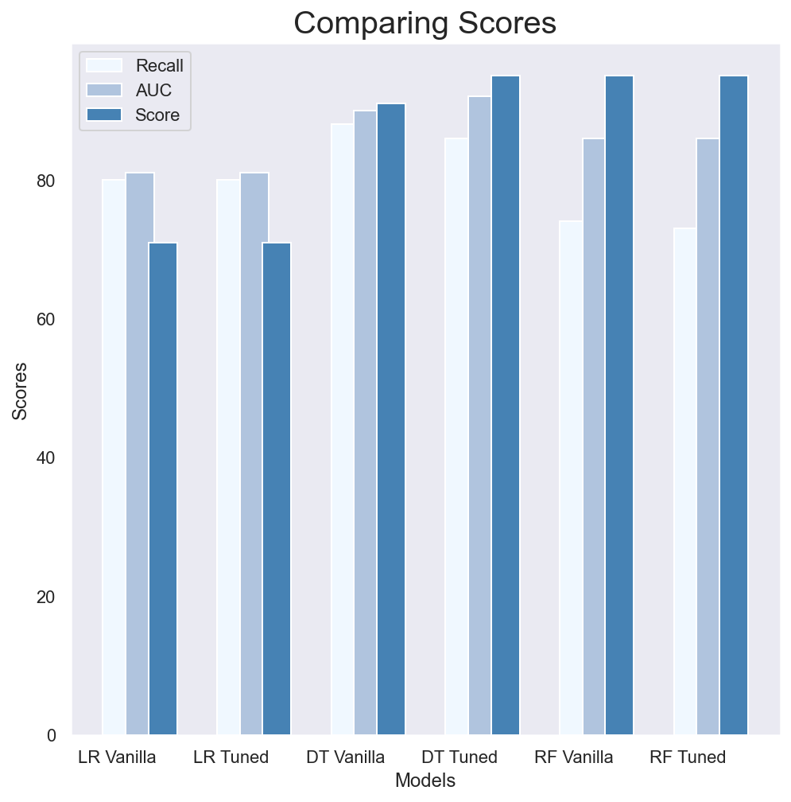

# Customer Churn Classification

## Table of Contents

* [Business Understanding](#business-understanding)
* [Data Understanding](#data-understanding)
* [Methods](#methods)
* [Best Performing Model](#best-performing-model)
* [Conclusion and recommendation](#conclusion-and-recommendation)

## Business Understanding

Syriatel is telecommunications company that has concerns regarding churn rate.Using customer account data,we will analyze what features from the data are most important in predicting customer churn, or whether or not they will leave the company. In order to do this the notebook will provide classification models aimed at producing the highest possible recall metric.Predicting as many positives as possible out of actual positives from dataset is the goal here, thus recall has been chosen as one of the performance matrices along with an accuracy score and AUC score

## Data Understanding

The dataset contains relevant `3333` customer account data including:

`state` : The state the customer is from

`account lenght` : The account length of the customer

`area code`: the customer's area code

`international plan` : Whether or not the customer has an international plan

`voice mail plan` : Whether or not the customer has a voicemail plan

The total `day, evening, night, and international minutes` of the customer

The total `day, evening, night, and international calls` of the customer

The total `day, evening, night, and international charge` of the customer

`customer service call` : The total customer service calls of the customer

`churn` : Whether or not the customer was 'true' or 'false' churn (true churn meaning that they have left the company, this will be the primary focus of the models)

## Methods

* Using data to create classification models to predict customer churn
* Analyzing model according to recall metric
* Analyzing best performing model for top feature importance
* Conclusion and Business Recommendation

## Best Performing Model 

Throughout the project, our goal was reducing False Negatives (Type II error). We got the best recall result with Decision Tree (Tuned Model). So we focused on what features on this model we should consider to prevent customer churn.

## Conclusion and recommendation

* Work on total charge and making promotions on this feature  especially those who call customer service.
* Improving customer service. The more customer service calls, the more people leave the plan.
* Focus on international plan and prevent international customer from leaving

## Additional Information
* [Presentation Slide](pdfs/presentation.pdf)
* [Data Source](https://www.kaggle.com/datasets/becksddf/churn-in-telecoms-dataset)

